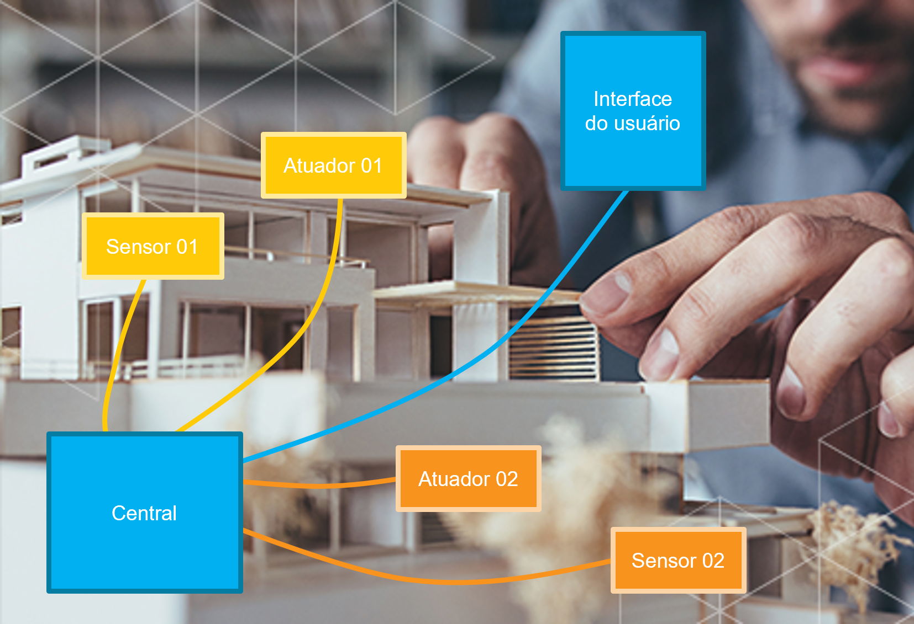

# Kit Interativo para Ensino de Automação em Turmas de Arquitetura baseado em Hardware Dinamicamente Reconfigurável
###  Projeto Final de Curso de Graduação em Engenharia Elétrica Eletrônica pela [Escola Politécnica de Pernambuco (Poli/UPE)](https://poli.br/) em 2025.1.

>**Observação:** Visando isolar os projetos, mas preservando o histórico de commits, este repositório trata-se de um fork do [projeto](https://github.com/Microcontroladores-UPE-2023-2/Projeto_uC_UPE) que desenvolvi durante a disciplina de Microcontroladores em 2023.2, orientado pela Profª Andrea Maria N. C. Ribeiro.

## Objetivos:
O projeto traz como principal objetivo o desenvolvimento de um kit didático, interativo e modular para o ensino dos fundamentos relacionados a sistemas de automação para um público não técnico, especialmente para turmas de graduação e especialização em Arquitetura e Urbanismo. O kit pode ser integrado a maquetes físicas de projetos reais, visando difundir o conhecimento a respeito de tecnologia a partir do seu uso interativo durante aulas práticas.

Para isso, foi proposta a construção de blocos com sensores e atuadores encapsulados e com conectores padronizados; além de um módulo central de controle, baseado em microcontrolador, com suporte à conexão de múltiplos blocos arbitrariamente escolhidos pelo usuário; a implementação de um firmware com lógicas pré-programadas referentes às automações típicas; o desenvolvimento de uma interface gráfica web amigável, que assegure ao usuário final um alto nível de abstração ao hardware e ao software, sem necessidade de conexão à Internet ou a quaisquer serviços externos. O projeto propõe também assegurar o paralelismo e a independência das automações configuradas pelo usuário final. Além de garantir a entrega de um hardware considerado hot-swappable, ou seja, que permita a substituição de componentes sem precisar desligar ou interromper sua utilização.

