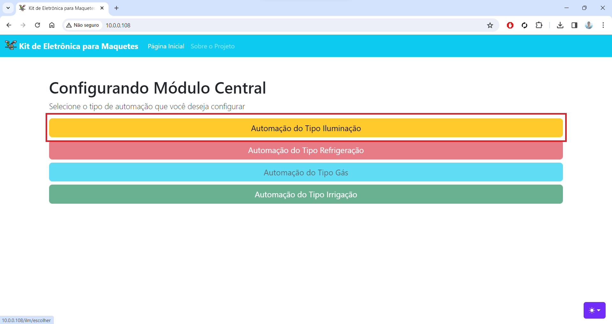
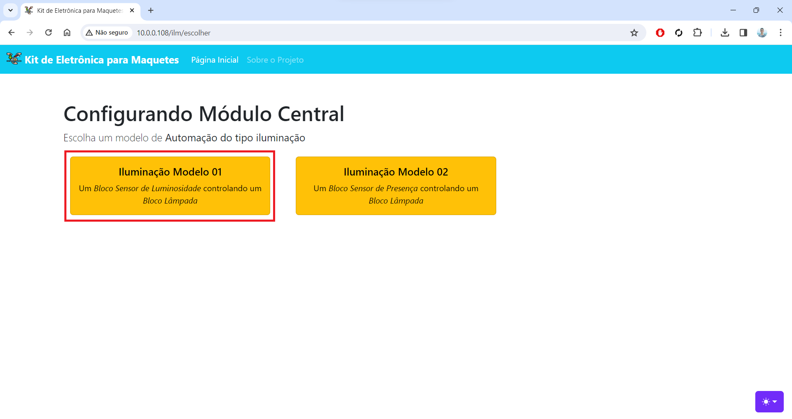
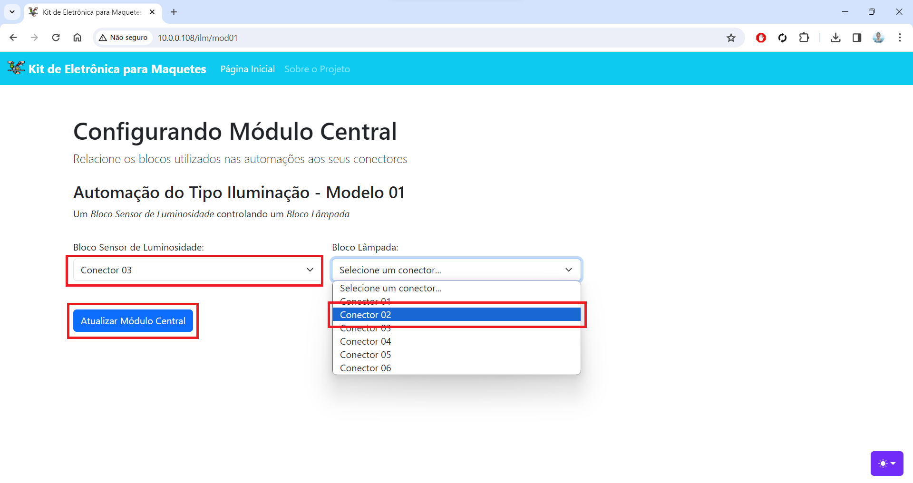
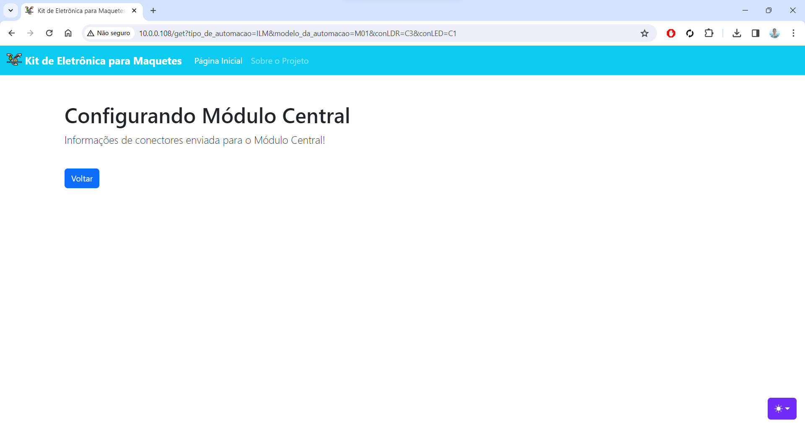

# Kit de Eletrônica para Maquetes de Arquitetura

## Orientadora: Profª Andrea Maria

## **Introdução**:

O projeto consiste no desenvolvimento de conjuntos de blocos “Plug and Play”, com eletrônica embarcada, referentes à domótica de projetos arquitetônicos.

Usuários (mesmo leigos em eletrônica e programação) poderão adicionar os conjuntos de blocos a maquetes de arquitetura e configurar, a partir de uma interface amigável, quais blocos tem relação entre si.

Em poucos passos o usuário poderá ter de forma interativa em sua maquete o comportamento de automações reais, agregando valor ao seu produto.

## **Links Úteis**:

- [Diagrama de Blocos - Figma](https://www.figma.com/file/gwqnpKY4aKcTteURtjPVdM/Diagrama---Projeto-Kit-de-eletr%C3%B4nica-para-maquetes-de-arquitetura?type=whiteboard&node-id=0%3A1&t=AzJPs2MEIsFIb5rH-1)

<!-- ## **Exemplo de funcionamento da versão atual**:

Ao ligar o Módulo Central (ESP32), um webservice é iniciado, onde o usuário pode informar à central, quais blocos plugou em quais conectores (estes são conectores com identificação simples para o usuário, mas que internamente se conectam a GPIOs do ESP32).

Neste exemplo de uso, dois blocos do tipo "Lâmpada" foram conectados aos conectores 1 e 2 do Módulo Central e dois blocos do tipo "Sensor de luminosidade" foram conectados aos conectores 3 e 4.

### **Exemplo de Montagem 01**:

Na primeira montagem deste exemplo, o usuário configurou o sensor em 3 como controlador da iluminação em 2:

### **Exemplo de Montagem 02**:

Na segunda montagem deste exemplo, o usuário configurou o sensor em 3 como controlador da iluminação em 1.

### **Conclusão:**

A interface do usuário foi acessada através do navegador no endereço de IP do Módulo Central (porta 80). E as configurações de remapeamento de conectores foram feitas em tempo de execução, sem que o microcontrolador precisasse ser reiniciado. -->
