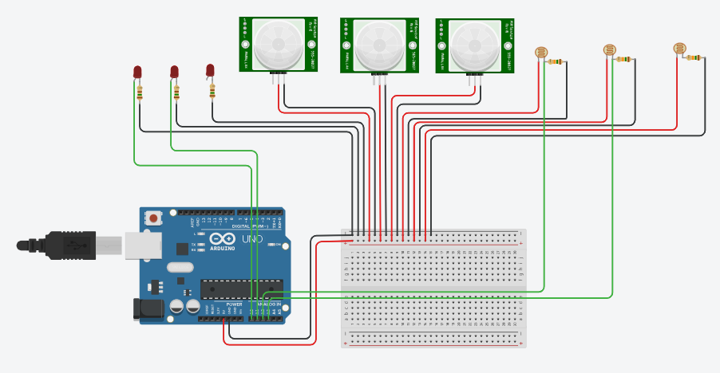

# Simulação no Tinkercad
## Adaptação com Arduino no lugar da ESP32

[Link para **Simulação no Tinkercad**](https://www.tinkercad.com/things/9RlsVM4j3ot-simulacao-sistema-integrado-entrega-060324?sharecode=45vSNcvdOfVmOsR98WhpwKhoP42aTDv7M-vYLuvkULo)

## **Importante**:

No projeto real está sendo utilizado o ESP32, tanto pela maior quantidade de GPIOs analógicos ser necessária, quanto pela interface do usuário (para configuração das conexões aos blocos) se dar através de um webservice.

Por limitações dos simuladores, decidiu-se substituir apenas na simulação a plataforma de desenvolvimento pelo Arduino UNO, adaptando os trechos de códigos referentes à interface do usuário por uma comunicação Serial em uma estrutura padronizada.

## **Instruções de uso da simulação**:

Como o projeto consiste em partes interconectáveis, a decisão de qual "Bloco" será conectado a qual "Conector" (pino de IO do microcontrolador) fica dependente da necessidade do usuário.

Obs.: "Conectores" são nomes simplificados e ordenados para um remapeamento dos GPIOs do microcontrolador. Ou seja, o usuário não saberá que está conectando um LED ao pino 13, o que ele verá é que está conectando o "Bloco Lâmpada" no "Conector 01", por exemplo.

Para o presente exemplo, 3 blocos de cada tipo (Bloco Lâmpada, Bloco Sensor de Presença e Bloco Sensor de Luminosidade) foram conectados às GPIOs do microcontrolador.

No entanto, o firmware que é executado no Módulo Central, responsável por "orquestrar" as conexões entre os blocos, atualmente está limitado ao uso de necessariamente 2 conjuntos simultâneos de automações, onde cada "Bloco Sensor de Luminosidade" controla um "Bloco Lâmpada". O firmware segue em desenvolvimento para que múltiplas combinações possam ser feitas incluindo o uso do "Bloco Sensor de Presença".

Para simular o comportamento do projeto desenvolvido até então, inicie a simulação, e envie por Serial uma String no seguinte formato:
"conector_ldr1" + "," + "conector_led1" + "," + "conector_ldr2" + "," + "conector_led2".

Exemplo 01:
Envie "3,1,4,2" e os LDRs em 3 e 4 passarão a controlar os LEDs em 1 e 2, respectivamente

Exemplo 02:
Envie "4,1,3,2" e os LDRs em 4 e 3 passarão a controlar os LEDs em 1 e 2, respectivamente